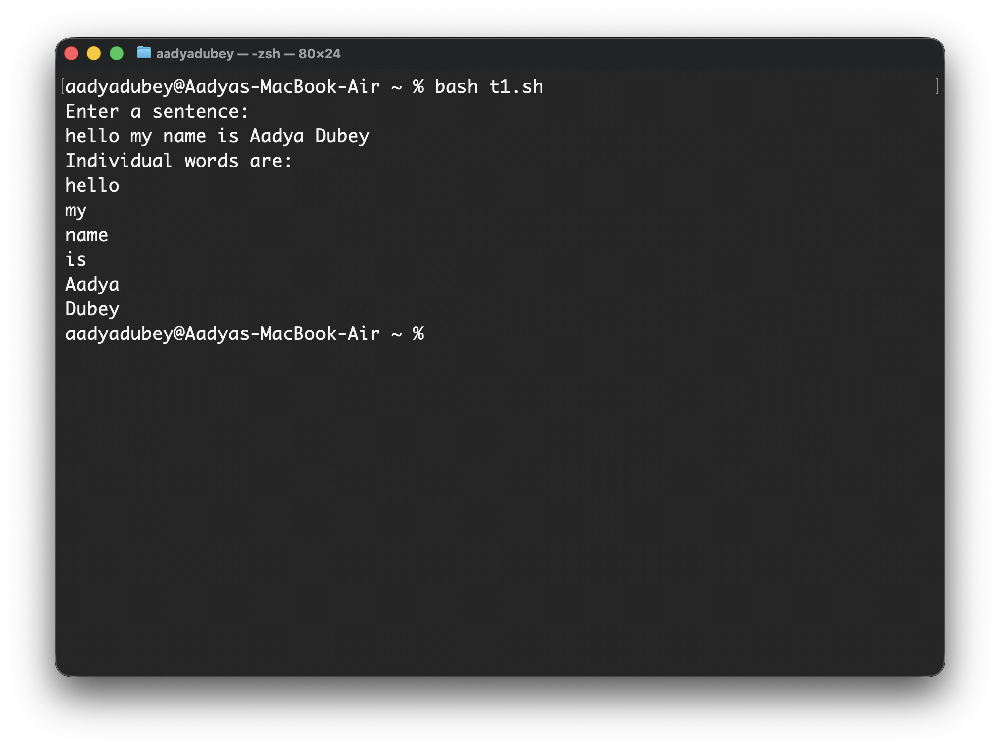
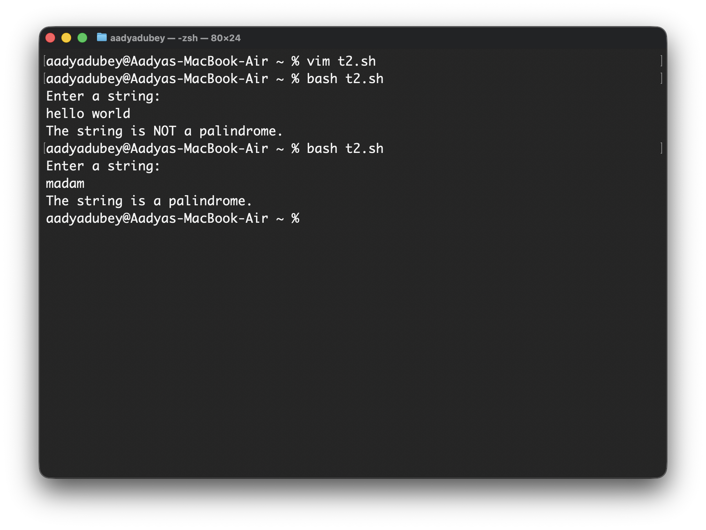

# Experiment 11: Shell Programming
**Name:** Aadya Dubey  
**Roll No.:** 590029213  
***
# Theory 
* Interacting with Users: Interactive shell scripts
* Parsing and Processing Data Formats 
* Interacting with Databases
***
***
# Lab task 1: Write a script that takes a sentence as input and splits it into individual words.
## Script:
```bash
#!/bin/bash
echo "Enter a sentence:"
read sentence

echo "Individual words are:" 
for word in $sentence 
do
	echo "$word"
done
```
##  Output:

# Lab task 2: Create a script that checks whether a given string is a palindrome or not.
## Script:
```bash
#!/bin/bash

echo "Enter a string:"
read str

rev=$(echo "$str" | rev)

if [ "$str" = "$rev" ]; then
    echo "The string is a palindrome."
else
    echo "The string is NOT a palindrome."
fi

exit 0
```
##  Output:

***
# Conclusion

* The word splitting and palindrome checking scripts were successfully implemented using basic shell scripting commands. 
* These experiments helped in understanding string handling, loops, and conditional statements in Linux. 
* The results obtained were accurate for normal inputs, and the experiments improved practical knowledge of text processing using shell scripts.
